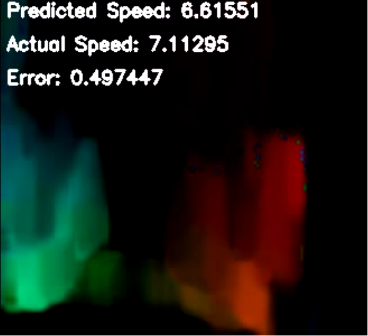

# SpeedNet

## Train
SpeedNet is pretrained but if you'd like to retrain it use:

`python speednet.py video.mp4 speed.json --mode=train --split=0.3`

If you'd like to continue training using the pretrained network then add the `--resume` flag to that line.

If any modifications are made to the optical flow part of the model then `--wipe` must be used to reprocess the data

## Test
To test SpeedNet use:

`python speednet.py video.mp4 speed.json --mode=test`

This will print the mean squared error
If you get an outrageously high number then then weight loaded wrong. Just try again.

## Play
If you want a more graphical display you can use the play mode. This will output the Optical Flow video with prediction overlay.

`python speednet.py video.mp4 speed.json --mode=play`

The output video file can be found in `flow.avi`. Simple modifications can be made to play it live, but I was working on a server and didn't have a VNC setup.

## My Approach
The network starts by performing dense(farneback) optical flow on 2 frames. The frames are then scaled to 100x100 and feed into a 4 layer CNN which connects to a 2 layer fully connected network. The reason I used optical flow was to help the network generalize. Instead of picking up on static visual cues for speed estimate it would look at the change in environment over successive frames. This method isn't super great because lighting and environment conditions may not always be the best for performing optical flow but assuming the environment doesn't change a lot, it works.

## Concerns
This network performs fairly well, but I am still afraid of overfitting. I tried to overcome this using a 70% train, 30% validation split, but I am not convinced that did the job. If I had more time I may have tried to augment frames to generate more data and help it generalize, but I'm not certain that would have helped given the video is preprocessed using optical flow.

## Other approaches
I tried to estimate the speed using static frames(other/speednet_static). It worked but I was afraid of overfitting. I also tried a dual CNN which processed 2 successive frames then merged them into a fully connected network(other/speednet_dual) in hopes that it would learn optical flow. But I realized it has the same downfall as the static recognition, as there is no guarantee that I am training the network to see optical flow. It could still just be extracting landmark features like the static version mentioned above. I would like further explore these 2 methods if I had more data and time but oh well.

## Requirements(Tested on)
- Python 2.7.6
- OpenCV 2.4.8
- Numpy 1.11.2
- Keras 1.1.0
